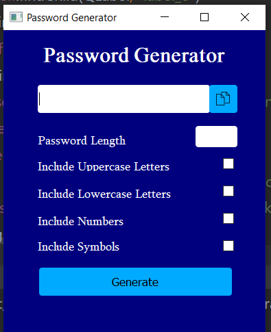
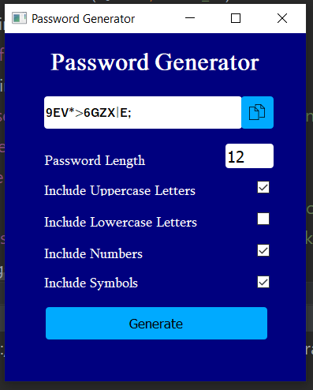

# Password-generator

Password generator made in PyQt. You can use it as agreed in the license.
### Information
Just simple password generator. Use this tool to generate your passwords, you can decide how long password has to be and which types of chars should be in it, choose language and copy generated password by one simple button! 

   

   

### Installation
1. pip install -r requirement.txt
2. Run generator.py

## Author
* **Afsaneh Shamsaddini**
